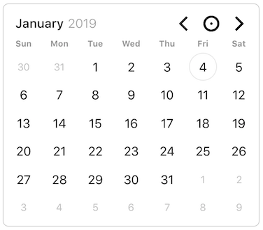

# pickadate.js

The composable date & time picker 🕰

### Example

Write this:

```js
const element = document.getElementById('pickadate')
pickadate.create().render(pickadateElement)
```

To render this:



<br />

## Contributors

<!-- ALL-CONTRIBUTORS-LIST:START - Do not remove or modify this section -->
<!-- prettier-ignore -->
| [<br /><sub><b>amsul</b></sub>](http://amsul.ca)<br />[💬](#question-amsul "Answering Questions") [📝](#blog-amsul "Blogposts") [🐛](https://github.com/Amsul/pickadate.js/issues?q=author%3Aamsul "Bug reports") [💻](https://github.com/Amsul/pickadate.js/commits?author=amsul "Code") [🎨](#design-amsul "Design") [📖](https://github.com/Amsul/pickadate.js/commits?author=amsul "Documentation") [💡](#example-amsul "Examples") [👀](#review-amsul "Reviewed Pull Requests") [⚠️](https://github.com/Amsul/pickadate.js/commits?author=amsul "Tests") [🌍](#translation-amsul "Translation") [✅](#tutorial-amsul "Tutorials") | [<br /><sub><b>Daniel Ruf</b></sub>](https://daniel-ruf.de)<br />[💬](#question-DanielRuf "Answering Questions") [🐛](https://github.com/Amsul/pickadate.js/issues?q=author%3ADanielRuf "Bug reports") [💻](https://github.com/Amsul/pickadate.js/commits?author=DanielRuf "Code") [👀](#review-DanielRuf "Reviewed Pull Requests") |
| :---: | :---: |
<!-- ALL-CONTRIBUTORS-LIST:END -->

👋 Interested becoming a contributor too?

Awesome! This project follows the [all-contributors](https://github.com/kentcdodds/all-contributors)
specification. Contributions of any kind are welcome!
